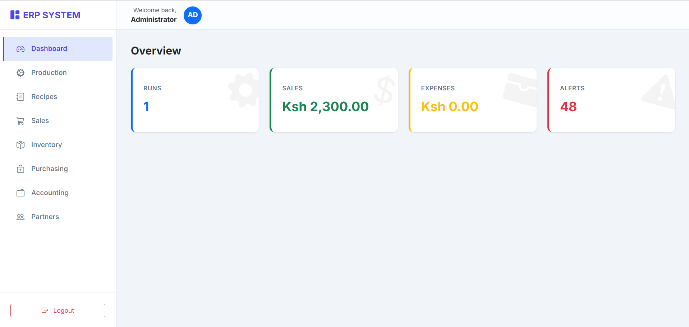
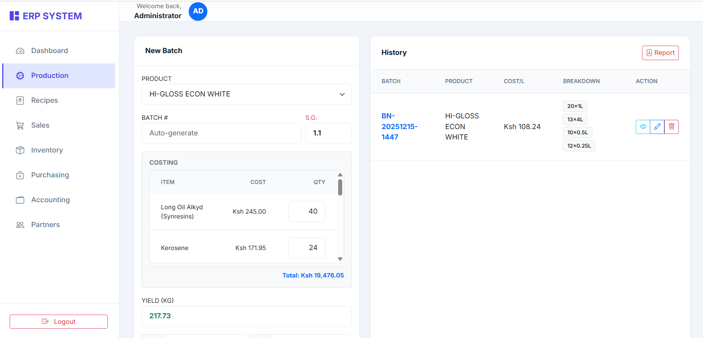
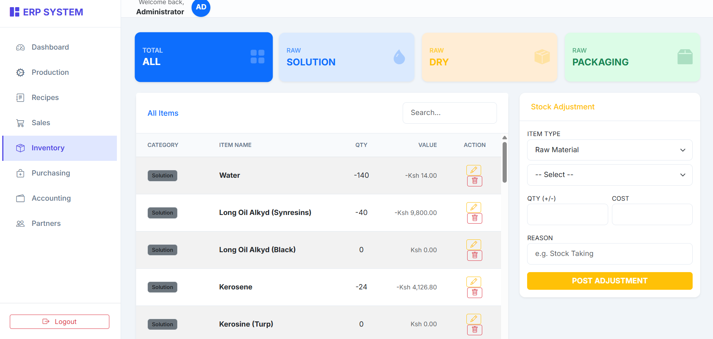
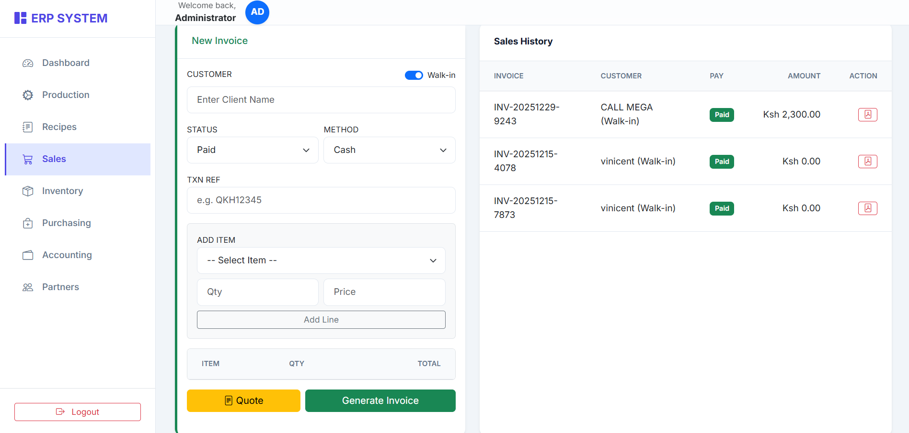

# 🏭 Production ERP System

A comprehensive, full-stack Enterprise Resource Planning (ERP) system designed for manufacturing businesses (e.g., Paint & Chemical industries). This system manages the entire lifecycle from raw material procurement and recipe management to production, inventory control, and sales.

## 🚀 Features

* **📊 Interactive Dashboard**: Real-time overview of production runs, sales performance, and low stock alerts.
* **⚗️ Production Management**: 
    * Define product recipes with specific gravity (S.G.) and overhead calculations.
    * Auto-calculate yield and unit costs.
    * Track batch history and packaging breakdowns.
* **📦 Inventory Control**:
    * Track Raw Materials (Solution, Dry Powder, Packaging).
    * Real-time stock deduction upon production.
    * Finished goods tracking.
* **💰 Sales & Invoicing**:
    * Manage Customers and Sales Reps.
    * Generate PDF Invoices and Quotations.
    * Track partial payments and credit balances.
* **🚚 Procurement**: Raise Purchase Orders (LPO) and receive stock.
* **👥 User Management**: Role-based access (Admin default).

## 🛠️ Tech Stack

* **Backend**: .NET 7 / 8 (C#), ASP.NET Core Web API
* **Database**: SQLite (Entity Framework Core)
* **Frontend**: HTML5, Bootstrap 5, Vanilla JavaScript (ES6)
* **PDF Generation**: jsPDF & AutoTable

## 📸 Screenshots

### 1. Dashboard Overview

*Real-time metrics for production and sales.*

### 2. Production Module

*Manage recipes, calculate batch costs, and record yields.*

### 3. Inventory Management

*Track raw material categories and stock levels.*

### 4. Sales & Invoicing

*Generate invoices and track payments per salesperson.*

## 🔧 Installation & Setup

### Prerequisites
* [.NET SDK](https://dotnet.microsoft.com/download) (Version 7.0 or later)
* A modern web browser (Chrome/Edge)

### Steps
1.  **Clone the repository**
    ```bash
    git clone [https://github.com/yourusername/production-erp.git](https://github.com/yourusername/production-erp.git)
    cd production-erp
    ```

2.  **Run the Backend**
    Navigate to the API folder and start the server. The database will be created and seeded automatically on the first run.
    ```bash
    cd ProductionApi
    dotnet run
    ```
    *The API will start at `http://localhost:5000`.*

3.  **Launch the Frontend**
    Open the `Frontend/index.html` file in your browser.

4.  **Login**
    * **Username**: `admin`
    * **Password**: `password`

## 📂 Project Structure
* **ProductionApi**: Contains the C# backend logic, database context, and API controllers.
* **Frontend**: Contains the user interface logic (`index.html`).

## 🤝 Contributing
Contributions are welcome! Please fork the repository and create a pull request for any feature enhancements.

## 📄 License
This project is licensed under the MIT License.